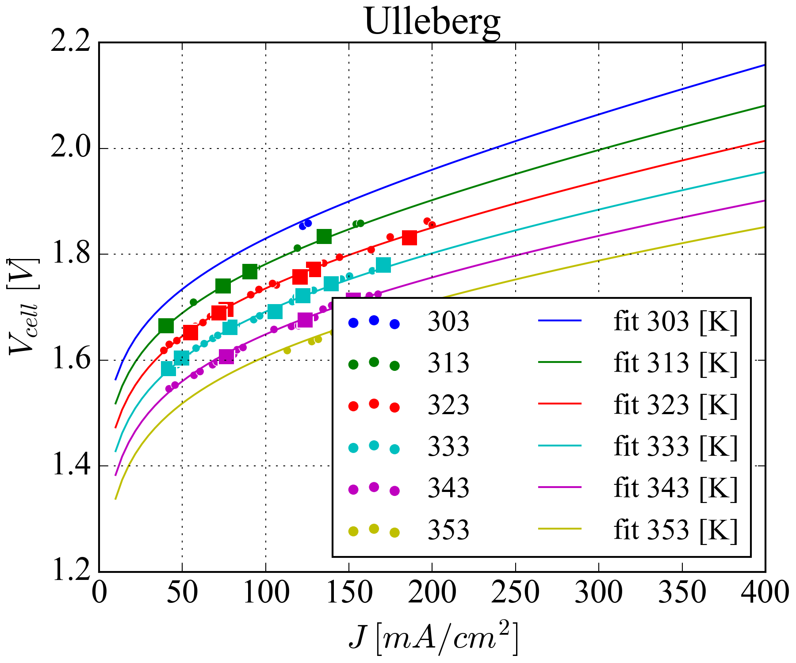
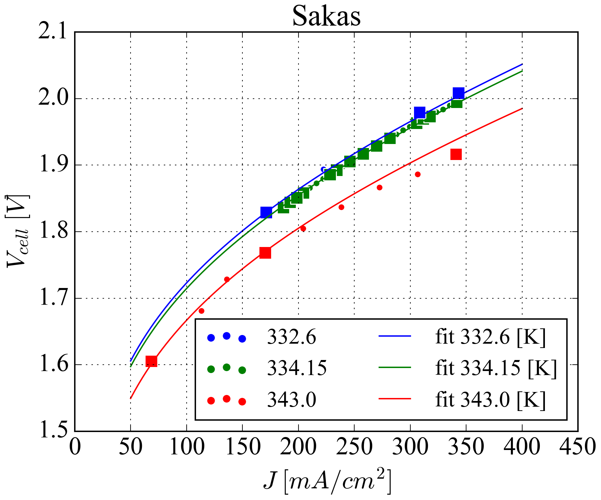
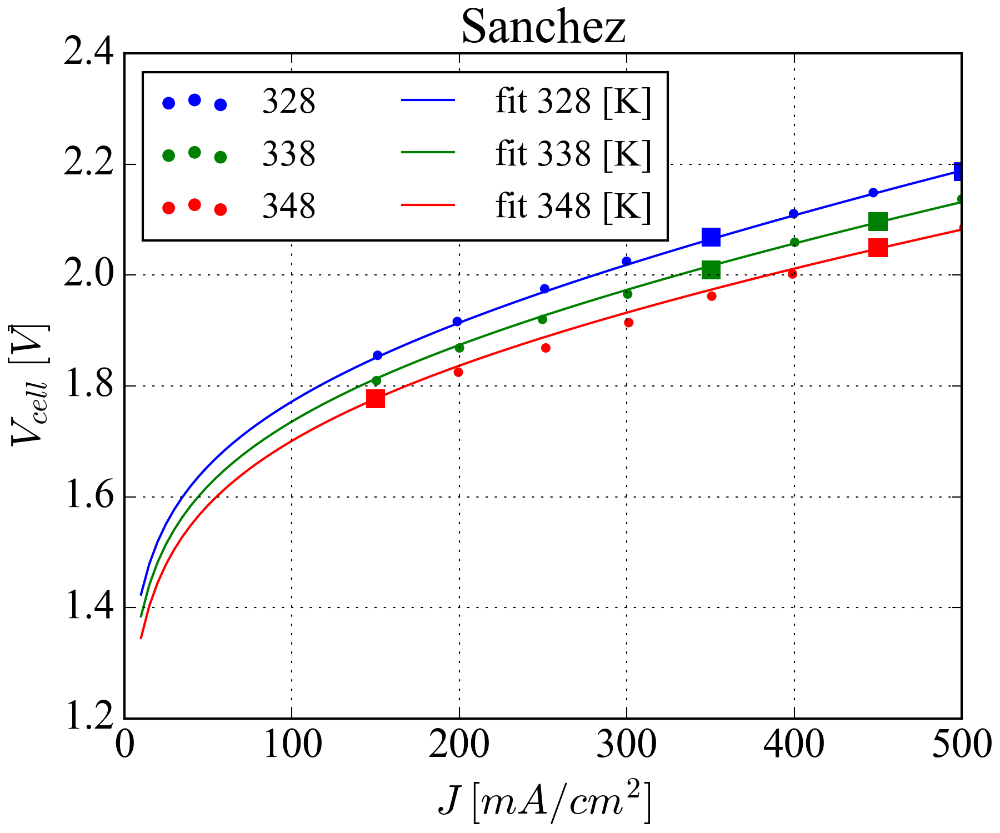
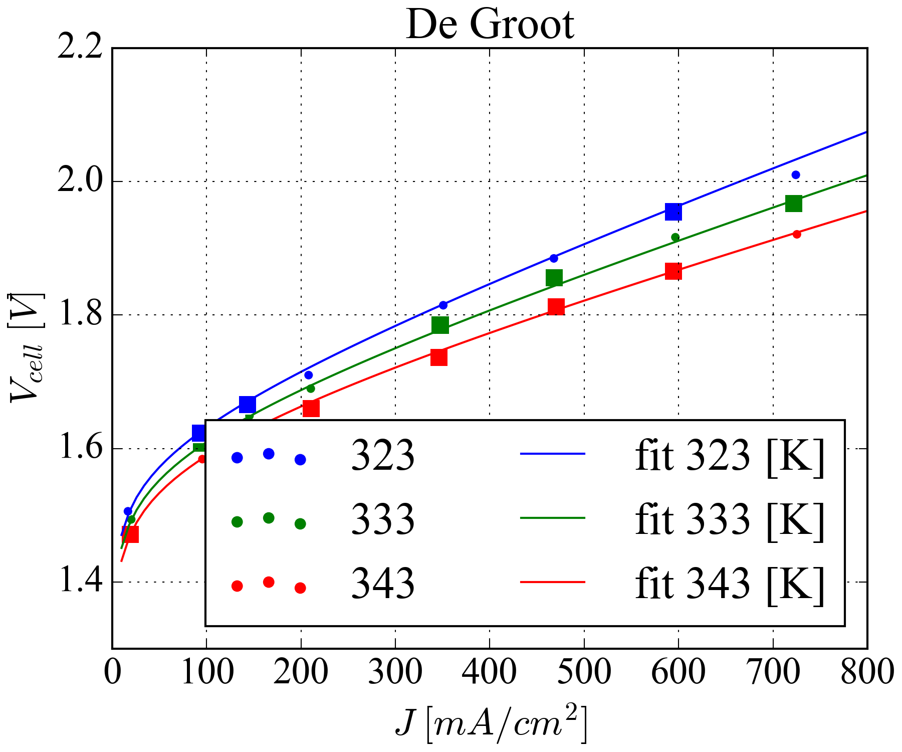

# AEC-Modelling
DTU Alkaline electrolyser modelling built during visitng PhD period @ DTU.  

## Description of the model 🧰
The objective is to build a model that can describe the polarisation curve, which depends on the setting parameters such as:  
- Wt% of the electrolyte, in this specific case we are talking about KOH 
- Temperature
- Operating pressure, which directly influences electrolyte density

## Files description 📂

There are basically 4 types of files in this repository  
- Main, is the main operating code 
- func_class, is the classs of the actual AEC model, containing every function built 
- "Fitting Parameters" folder contains dataframe and txt files, are polynomial or Arrenhius coefficients for $i_0$ and $\alpha$, obtained through the fitting of the experimental data from Kibria and Miles experiments
- "Experiments" folder contain.csv files, are data from bachelor thesis ( including both Comsol and experimental data) and the one from Henrik

## Examples 🖼️

  
 

  
  

## References
Below i report all literature used, divided by category:

### Reversible voltage
[1] 	Domain E, Conductivity SE. A Comprehensive Survey of Alkaline Electrolyzer Modeling : Electrical Domain and Specific Electrolyte Conductivity 2022. 
[2]	Kibria MF, MRIDHA MS. Electrochemical studies of the Nickel electrod for the oxygen evolution reaction. Science (80- ) 1996;21.

### Anodic overpotential experiments
[2]	Kibria MF, MRIDHA MS. Electrochemical studies of the Nickel electrod for the oxygen evolution reaction. Science (80- ) 1996;21.  
[3]	Miles MH, Kissel G, Lu PWT, Srinivasan S. Effect of Temperature on Electrode Kinetic Parameters for Hydrogen and Oxygen Evolution Reactions on Nickel Electrodes in Alkaline Solutions. J Electrochem Soc 1976;123:332–6. https://doi.org/10.1149/1.2132820.

### Cathodic overpotential experiments
[3]	Miles MH, Kissel G, Lu PWT, Srinivasan S. Effect of Temperature on Electrode Kinetic Parameters for Hydrogen and Oxygen Evolution Reactions on Nickel Electrodes in Alkaline Solutions. J Electrochem Soc 1976;123:332–6. https://doi.org/10.1149/1.2132820.  
[4]	Kibria MF, Mridha MS, Khan AH. Electrochemical studies of a nickel electrode for the hydrogen evolution reaction. Int J Hydrogen Energy 1995;20:435–40. https://doi.org/10.1016/0360-3199(94)00073-9.  
[5]	Huot J ‐Y. Hydrogen Evolution and Interface Phenomena on a Nickel Cathode in 30 w/o KOH : I . Kinetics Parameters and Electrode Impedance Between 303 and 363 K. J Electrochem Soc 1989;136:1933–9. https://doi.org/10.1149/1.2097088.

### Electolyte overpotential and ionic conductivity 
[6]	Gilliam RJ, Graydon JW, Kirk DW, Thorpe SJ. A review of specific conductivities of potassium hydroxide solutions for various concentrations and temperatures. Int J Hydrogen Energy 2007;32:359–64. https://doi.org/10.1016/j.ijhydene.2006.10.062.

### Mass tranposort through diaphram
[7]	Vermeiren P, Adriansens W, Moreels JP, Leysen R. Evaluation of the zirfon® separator for use in alkaline water electrolysis and Ni-H2 batteries. Int J Hydrogen Energy 1998;23:321–4. https://doi.org/10.1016/s0360-3199(97)00069-4.

### Concentration assessment
- COH  
[6]		Gilliam RJ, Graydon JW, Kirk DW, Thorpe SJ. A review of specific conductivities of potassium hydroxide solutions for various concentrations and temperatures. Int J Hydrogen Energy 2007;32:359–64. https://doi.org/10.1016/j.ijhydene.2006.10.062.

- CO2   
[8]		Tromans D. Temperature and pressure dependent solubility of oxygen in water: A thermodynamic analysis. Hydrometallurgy 1998;48:327–42. https://doi.org/10.1016/s0304-386x(98)00007-3.

### Electrolyte density
[6]	Gilliam RJ, Graydon JW, Kirk DW, Thorpe SJ. A review of specific conductivities of potassium hydroxide solutions for various concentrations and temperatures. Int J Hydrogen Energy 2007;32:359–64. https://doi.org/10.1016/j.ijhydene.2006.10.062.

### Hydrogen and oxygen diffusion
[9] 	Tham MK, Walker RD, Gubbins KE. Diffusion of oxygen and hydrogen in aqueous potassium hydroxide solutions. J Phys Chem 1970;74:1747–51. https://doi.org/10.1021/j100703a015.

### Bubbles evaluation
[10]	Vogt H, Balzer RJ. The bubble coverage of gas-evolving electrodes in stagnant electrolytes. Electrochim Acta 2005;50:2073–9. https://doi.org/10.1016/j.electacta.2004.09.025.  
[11]	Hammoudi M, Henao C, Agbossou K, Dubé Y, Doumbia ML. New multi-physics approach for modelling and design of alkaline electrolyzers. Int J Hydrogen Energy 2012;37:13895–913. https://doi.org/10.1016/j.ijhydene.2012.07.015.  
[12]	Mandin P, Derhoumi Z, Roustan H, Rolf W. Bubble over-potential during two-phase alkaline water electrolysis. Electrochim Acta 2014;128:248–58. https://doi.org/10.1016/j.electacta.2013.11.068  
[13]	Henao C, Agbossou K, Hammoudi M, Dubé Y, Cardenas A. Simulation tool based on a physics model and an electrical analogy for an alkaline electrolyser. J Power Sources 2014;250:58–67. https://doi.org/10.1016/j.jpowsour.2013.10.086.

